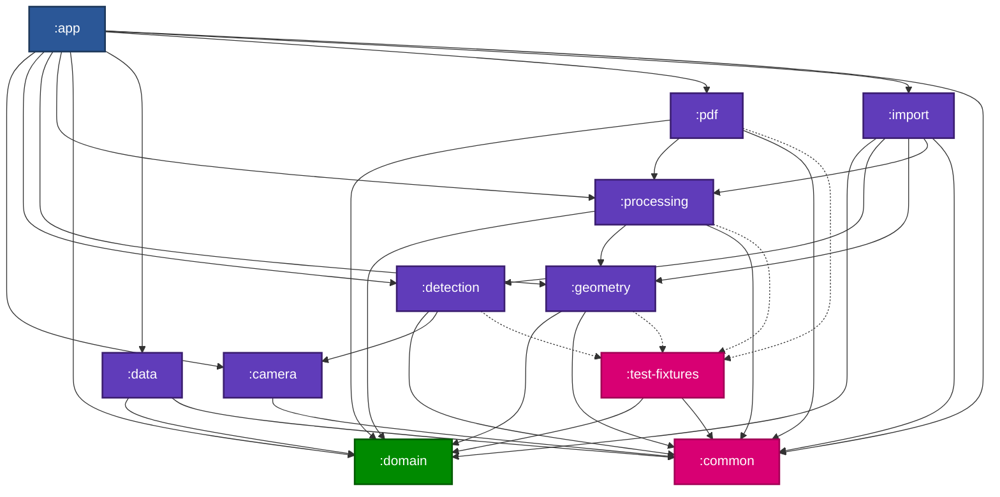
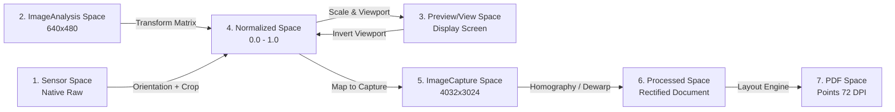
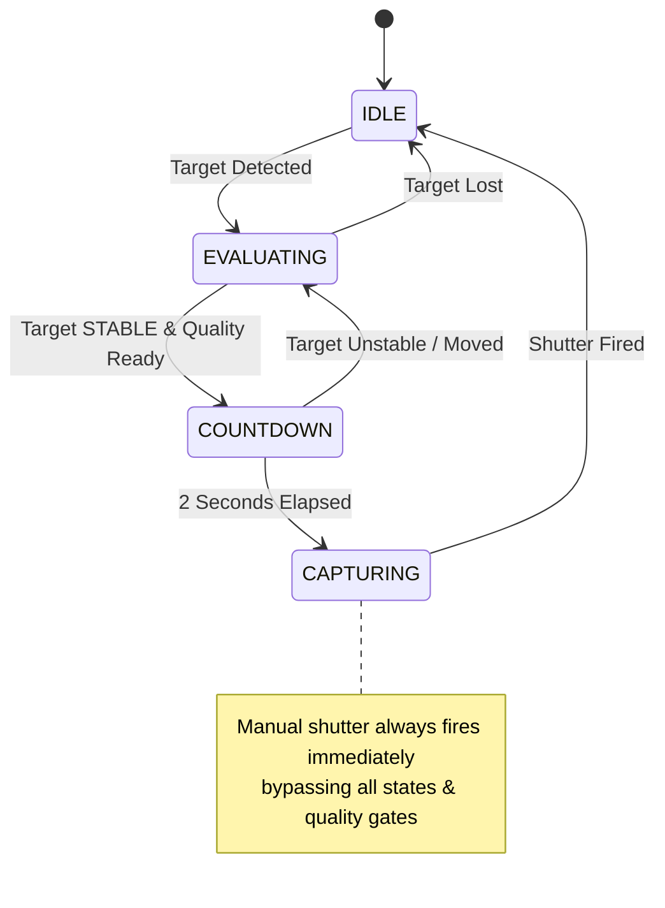
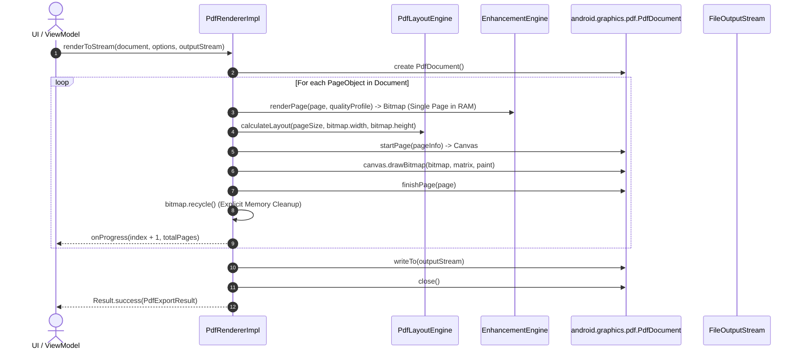

# yScanner (LocalScan) — Comprehensive Technical Architecture Report

**Document Version:** 1.0.0  
**Date:** 2026-10-01  
**Author:** `spec_miner_survey_2` (Specification Miner)  
**Target System:** Native Android (Kotlin 2.0.x, Jetpack Compose, CameraX, OpenCV Android SDK, LiteRT/TFLite, Coroutines, Gradle KTS)  
**Primary References:** `ARCHITECTURE.md`, `PRD.md`, `AGENTS.md`, `ORIGINAL_REQUEST.md`, `plans/000-master-plan.md` through `plans/023-release-hardening.md`, `plans/spikes/*`

---

## Executive Summary

yScanner (LocalScan) is a high-performance, privacy-first native Android document scanner application. It executes entirely on-device with zero cloud dependencies. The system balances lightweight, real-time camera preview detection (≥15 FPS, ≤50 ms inference, ≤2 frames overlay latency) with high-fidelity, memory-constrained post-capture image processing (peak RAM ≤800 MB, normal workflow ≤600–700 MB on 8 GB RAM target devices).

This report mines and synthesizes the authoritative technical specifications across six structural dimensions:
1. **Module Boundaries and Dependency Graph**
2. **Key Interfaces and Data Contracts**
3. **Coordinate Transformation Architecture (The 7 Spaces)**
4. **Detection, Geometry, and Processing Pipeline Designs**
5. **Persistence and PDF Streaming Architecture**
6. **Proposed Milestone Structure & Implementation Roadmap**

---

# 1. Module Boundaries and Dependency Graph

LocalScan adopts a multi-module architecture designed to enforce clean separation of concerns, strict boundary isolation, testability without Android platform or hardware dependencies, and memory ownership guarantees.

```
yScanner/
├── :app                # Application entry, DI, Navigation, Compose UI shell & viewmodels
├── :camera             # CameraX lifecycle, Preview, ImageAnalysis, ImageCapture, Metering
├── :detection          # ML segmentation model, candidate extraction, tracking, target selection
├── :geometry           # Boundary extraction, outer envelope, quad fitting, refinement, dewarp
├── :processing         # Quality assessment, Natural & Clean enhancement, non-destructive render
├── :domain             # Pure Kotlin domain entities (PageObject, Document), geometry models, enums
├── :data               # Room persistence, session recovery, file storage hierarchy, asset lifecycle
├── :pdf                # Streaming PDF renderer, layout engine, quality profiles, size estimator
├── :import             # Android Photo Picker, EXIF orientation correction, batch pipeline entry
├── :common             # Shared primitives, math utilities, concurrency dispatchers, logging
└── :test-fixtures      # Synthetic masks, golden test images, mock detectors, test harnesses
```

### Module Responsibilities & Boundary Invariants

| Module | Android Dependency | Key Responsibilities | Primary Invariants |
|---|---|---|---|
| `:common` | Android Library / Core-KTX | Math vectors, concurrency dispatchers, unified diagnostic logging, bitmap/buffer converters, shared exceptions. | No business or domain logic. Low-level primitives only. |
| `:domain` | **Pure Kotlin** (No Android SDK) | Authoritative models (`PageObject`, `Document`, `ScanSession`, `PageGeometry`), enums (`ScanMode`, `EnhancementMode`, etc.), repository interfaces. | **Zero** Android dependencies (`import android.*` strictly forbidden). Immutable data structures. |
| `:camera` | CameraX (`core`, `camera2`, `lifecycle`, `view`) | Camera lifecycle management, PreviewView binding, frame acquisition (`ImageAnalysis`), capture execution (`ImageCapture`), tap-to-focus/metering, 7-space coordinate transformation. | `ImageProxy` closed promptly on analysis thread. Frame queues never unbounded. Shutter never blocked by detection state. |
| `:detection` | LiteRT / TFLite, OpenCV (minimal) | Model lifecycle, inference adapter (`SegmentationModel`), mask extraction, candidate isolation (`DocumentCandidate`), target selection heuristics, temporal tracking/smoothing. | Replaceable ML runtime. Graceful fallback from GPU/NNAPI to CPU. No UI or persistence dependencies. |
| `:geometry` | OpenCV Android SDK | Convex outer envelope, quadrilateral fitting, ROI-based sub-pixel corner refinement, book spread detection, gutter curve extraction, non-linear dewarp mesh generation. | Resolves complex/concave shapes to enclosing quadrilaterals. Completely independent of Compose UI. |
| `:processing` | OpenCV Android SDK | Non-destructive image enhancement (`Original`, `Natural`, `Clean`), live and detailed quality assessment (`QualityAssessor`, `QualityMetrics`). | Non-destructive: source asset remains untouched. Quality metrics never force retakes or reject captures. |
| `:data` | Room, WorkManager, Android Storage | SQLite persistence (`AppDatabase`, `DocumentDao`), session metadata, file-backed asset management (`SourceAssetManager`), process death recovery, storage cleanup worker. | Source assets are never deleted while referenced by any `PageObject`. Derived images are disposable caches. |
| `:pdf` | Android `PdfDocument`, MediaStore | Page-by-page streaming PDF generation, multi-standard layout engine (A4, Auto, Letter, etc.), quality compression profiles, predictive size estimation. | PDF page size **never** influences document detection. Memory usage is $O(1)$ regardless of page count. |
| `:import` | Android Photo Picker, EXIF | System photo picker integration, EXIF rotation normalization, safe downsampling, routing external images into standard scanner pipeline. | Reuses identical geometry and processing pipeline as camera capture. |
| `:test-fixtures` | Android Library | Deterministic test images, synthetic binary masks, golden-image test runners, fake implementations (`FakeDocumentDetector`, `FakePdfWriter`). | Used strictly for test and benchmark targets. Never shipped in production APK. |
| `:app` | Jetpack Compose, Material3, DI | UI screens (`CameraScreen`, `PageManagerScreen`, `ManualCropScreen`, `ExportSettingsScreen`), ViewModels, use cases orchestration. | UI consumes state from use cases. Never calls OpenCV, ML interpreter, or CameraX directly. |

### Module Dependency Graph



### Architectural Dependency Inversion Rule
Dependencies strictly point inward:
$$\text{Presentation (:app)} \longrightarrow \text{Use Cases / Orchestration} \longrightarrow \text{Domain (:domain)} \longleftarrow \text{Infrastructure (:camera, :detection, :geometry, :processing, :data, :pdf)}$$
High-level policies in `:domain` do not import or know about concrete implementations in `:camera` (CameraX), `:detection` (LiteRT), `:geometry`/`:processing` (OpenCV), `:data` (Room), or `:pdf` (`android.graphics.pdf`).

---

# 2. Key Interfaces and Data Contracts

The interactions between subsystems are governed by explicit, typed Kotlin contracts with defined lifecycle ownership, threading dispatchers, and typed domain error models.

### 2.1 Camera Subsystem (`:camera`)

```kotlin
package com.localscan.camera

import android.graphics.PointF
import android.graphics.Rect
import androidx.camera.core.ImageProxy
import androidx.lifecycle.LifecycleOwner
import kotlinx.coroutines.flow.StateFlow
import java.io.File

interface CameraController {
    val cameraState: StateFlow<CameraState>
    fun bindToLifecycle(lifecycleOwner: LifecycleOwner)
    fun unbind()
    fun setFlashMode(flashMode: FlashMode)
    fun setTorch(enabled: Boolean)
    fun triggerMetering(previewPoint: PointF)
}

interface FrameAnalyzer {
    fun analyze(imageProxy: ImageProxy)
}

interface CaptureManager {
    suspend fun takePicture(targetFile: File): Result<CaptureResult>
}

data class CaptureResult(
    val file: File,
    val width: Int,
    val height: Int,
    val rotationDegrees: Int,
    val cropRect: Rect?,
    val timestampNanos: Long
)

enum class FlashMode { OFF, ON, AUTO, TORCH }
```
- **Lifecycle & Memory Contract:** `FrameAnalyzer` operates under `STRATEGY_KEEP_ONLY_LATEST`. `ImageProxy` must be released immediately via `imageProxy.close()` inside a `finally` block once converted to a lightweight input buffer. `CaptureManager` streams high-resolution stills directly to file storage without allocating full-resolution ARGB Bitmaps on the heap.

### 2.2 Detection & Tracking Subsystem (`:detection`)

```kotlin
package com.localscan.detection

import com.localscan.camera.transform.CoordinateTransformer
import com.localscan.domain.model.Quadrilateral
import java.nio.ByteBuffer

interface SegmentationModel {
    val inputWidth: Int
    val inputHeight: Int
    suspend fun infer(input: ModelInput): ModelOutput
    fun close()
}

data class ModelInput(
    val byteBuffer: ByteBuffer,
    val rotationDegrees: Int,
    val width: Int,
    val height: Int
)

data class ModelOutput(
    val maskBuffer: ByteBuffer,
    val maskWidth: Int,
    val maskHeight: Int,
    val confidence: Float
)

interface DocumentDetector {
    suspend fun detectCandidates(
        output: ModelOutput,
        transformer: CoordinateTransformer
    ): List<DocumentCandidate>
}

data class DocumentCandidate(
    val id: String,
    val quadrilateral: Quadrilateral,
    val confidence: Float,
    val area: Float,
    val contourPoints: List<PointF>
)

interface TargetSelector {
    fun selectTarget(
        candidates: List<DocumentCandidate>,
        previousTarget: TrackedTarget?,
        tapPoint: PointF?
    ): TrackedTarget?
}

interface TemporalTracker {
    fun update(
        selected: TrackedTarget?,
        timestampNanos: Long
    ): SmoothedTarget
    fun reset()
}

data class TrackedTarget(
    val id: String,
    val rawQuad: Quadrilateral,
    val confidence: Float,
    val trackingState: TrackingState,
    val framesTracked: Int
)

data class SmoothedTarget(
    val id: String?,
    val smoothedQuad: Quadrilateral?,
    val confidence: Float,
    val state: TrackingState,
    val isReadyForCapture: Boolean,
    val cornerVelocities: FloatArray
)

enum class TrackingState { SEARCHING, ACQUIRING, TRACKING, STABLE, LOST }
```
- **Concurrency & Model Contract:** Inference executes on a bounded background dispatcher (`Dispatchers.Default` or a single-thread executor). The model is loaded once per camera session lifecycle and closed when unbinding. If GPU/NNAPI delegate initialization throws an exception, the system catches it and falls back to CPU execution without crashing.

### 2.3 Geometry Engine Subsystem (`:geometry`)

```kotlin
package com.localscan.geometry

import android.graphics.Bitmap
import android.graphics.Rect
import com.localscan.domain.model.Quadrilateral

interface BoundaryExtractor {
    fun extractBoundary(mask: ByteArray, width: Int, height: Int): List<PointF>
}

interface EnvelopeComputer {
    fun computeConvexEnvelope(boundaryPoints: List<PointF>): List<PointF>
}

interface QuadrilateralFitter {
    fun fitQuadrilateral(envelope: List<PointF>, boundsWidth: Int, boundsHeight: Int): Quadrilateral
}

interface CornerRefiner {
    suspend fun refineCorners(
        approximateQuad: Quadrilateral,
        imageSource: ImageSource
    ): Quadrilateral
}

interface PerspectiveCorrector {
    suspend fun rectify(
        imageSource: ImageSource,
        refinedQuad: Quadrilateral
    ): Bitmap
}

interface SpreadAnalyzer {
    suspend fun analyzeSpread(imageSource: ImageSource): SpreadAnalysis
}

data class SpreadAnalysis(
    val isSpread: Boolean,
    val leftBoundary: Quadrilateral?,
    val rightBoundary: Quadrilateral?,
    val gutterLine: GutterLine?,
    val confidence: Float
)

data class GutterLine(
    val top: PointF,
    val bottom: PointF,
    val curvatureProfile: FloatArray
)

interface CurvatureEstimator {
    suspend fun estimateCurvature(
        imageSource: ImageSource,
        boundary: Quadrilateral,
        gutter: GutterLine
    ): CurvatureMap
}

data class CurvatureMap(
    val meshWidth: Int,
    val meshHeight: Int,
    val mapX: FloatArray,
    val mapY: FloatArray
)

interface Dewarper {
    suspend fun dewarp(
        imageSource: ImageSource,
        boundary: Quadrilateral,
        curvatureMap: CurvatureMap
    ): Bitmap
}
```
- **OpenCV & Memory Invariant:** All OpenCV `Mat` structures (`MatOfPoint`, `MatOfPoint2f`, temporary warped images) are wrapped in `try/finally` blocks calling `.release()`. ROI corner refinement decodes only 200–400 px regions via `BitmapRegionDecoder`, avoiding full-bitmap allocations.

### 2.4 Processing & Enhancement Subsystem (`:processing`)

```kotlin
package com.localscan.processing

import android.graphics.Bitmap
import com.localscan.domain.model.EnhancementMode
import com.localscan.domain.model.EnhancementParams
import com.localscan.domain.model.PageGeometry
import com.localscan.domain.model.QualityMetrics

interface QualityAssessor {
    fun assessLive(imageProxy: ImageProxy): QualityMetrics
    suspend fun assessDetailed(bitmap: Bitmap, geometry: PageGeometry): QualityMetrics
}

interface ImageEnhancer {
    suspend fun enhance(
        sourceBitmap: Bitmap,
        mode: EnhancementMode,
        params: EnhancementParams
    ): Bitmap
}
```
- **Non-Destructive Invariant:** `ImageEnhancer` receives the rectified document bitmap and produces an enhanced bitmap without altering original source captures. If processing encounters an OOM or failure, it returns the unenhanced image (`EnhancementMode.ORIGINAL`) and logs a diagnostic warning.

### 2.5 Domain Model Subsystem (`:domain`)

```kotlin
package com.localscan.domain.model

import java.io.File
import java.time.Instant

data class Document(
    val id: String,
    val name: String,
    val createdAt: Instant,
    val modifiedAt: Instant,
    val pages: List<PageObject>
) {
    val pageCount: Int get() = pages.size
}

data class PageObject(
    val id: String,
    val documentId: String,
    val sourceAssetFile: File,
    val geometry: PageGeometry,
    val rotationDegrees: Int, // 0, 90, 180, 270
    val enhancementMode: EnhancementMode,
    val enhancementParams: EnhancementParams,
    val qualityMetrics: QualityMetrics?,
    val metadata: PageMetadata,
    val processingState: ProcessingState
)

sealed interface PageGeometry {
    val outputWidth: Int
    val outputHeight: Int
    val sourceWidth: Int
    val sourceHeight: Int

    data class SinglePage(
        val quad: Quadrilateral,
        override val outputWidth: Int,
        override val outputHeight: Int,
        override val sourceWidth: Int,
        override val sourceHeight: Int
    ) : PageGeometry

    data class TwoPageSpread(
        val leftQuad: Quadrilateral,
        val rightQuad: Quadrilateral,
        val gutter: List<PointF>,
        val isLeftPage: Boolean,
        override val outputWidth: Int,
        override val outputHeight: Int,
        override val sourceWidth: Int,
        override val sourceHeight: Int
    ) : PageGeometry

    data class ManualCrop(
        val cropQuad: Quadrilateral,
        override val outputWidth: Int,
        override val outputHeight: Int,
        override val sourceWidth: Int,
        override val sourceHeight: Int
    ) : PageGeometry
}

data class Quadrilateral(
    val topLeft: PointF,
    val topRight: PointF,
    val bottomRight: PointF,
    val bottomLeft: PointF
) {
    fun isConvex(): Boolean
    fun area(): Float
    fun contains(point: PointF): Boolean
    fun toFloatArray(): FloatArray
}

data class QualityMetrics(
    val blurScore: Float,
    val glareScore: Float,
    val shadowScore: Float,
    val exposureScore: Float,
    val geometryScore: Float,
    val cropConfidence: Float,
    val cornerConfidence: Float,
    val overallScore: Float
)

data class EnhancementParams(
    val brightness: Float = 0f,
    val contrast: Float = 1f,
    val shadowReduction: Float = 0.5f,
    val sharpness: Float = 0.2f
)

enum class EnhancementMode { ORIGINAL, NATURAL, CLEAN }
enum class ScanMode { ONE_PAGE, TWO_PAGE }
enum class CaptureMethod { AUTO, MANUAL }
enum class SourceType { CAMERA, GALLERY }
enum class ProcessingState { PENDING, PROCESSING, COMPLETED, FAILED }
```

### 2.6 Persistence Subsystem (`:data`)

```kotlin
package com.localscan.data.repository

import com.localscan.domain.model.Document
import com.localscan.domain.model.PageObject
import java.io.File
import kotlinx.coroutines.flow.Flow

interface DocumentRepository {
    fun observeDocument(documentId: String): Flow<Document?>
    suspend fun getDocument(documentId: String): Document?
    suspend fun saveDocument(document: Document)
    suspend fun addPage(documentId: String, page: PageObject)
    suspend fun updatePage(page: PageObject)
    suspend fun removePage(documentId: String, pageId: String)
    suspend fun reorderPages(documentId: String, pageIds: List<String>)
    suspend fun deleteDocument(documentId: String)
}

interface SourceAssetManager {
    suspend fun allocateSourceFile(sessionId: String, extension: String = "jpg"): File
    suspend fun getDerivedCacheFile(pageId: String, key: String): File
    suspend fun pruneOrphanedAssets(retainedPaths: Set<String>)
}

interface SessionPersistence {
    suspend fun persistActiveSession(document: Document)
    suspend fun recoverInterruptedSession(): Document?
    suspend fun clearActiveSession()
}
```

### 2.7 PDF Export Subsystem (`:pdf`)

```kotlin
package com.localscan.pdf

import com.localscan.domain.model.Document
import java.io.File
import java.io.OutputStream

interface PdfRenderer {
    suspend fun renderToStream(
        document: Document,
        options: PdfExportOptions,
        outputStream: OutputStream,
        onProgress: (pageIndex: Int, totalPages: Int) -> Unit
    ): Result<PdfExportResult>
}

interface PdfSizeEstimator {
    fun estimateSizeBytes(document: Document, options: PdfExportOptions): Long
}

data class PdfExportOptions(
    val pageSize: PdfPageSize = PdfPageSize.A4,
    val qualityProfile: PdfQualityProfile = PdfQualityProfile.BALANCED,
    val customFileName: String? = null
)

enum class PdfPageSize { A4, AUTO, A5, B5, LETTER, ORIGINAL_RATIO }

enum class PdfQualityProfile(
    val scaleFactor: Float,
    val jpegQuality: Int,
    val maxDpi: Int
) {
    HIGH(scaleFactor = 1.0f, jpegQuality = 90, maxDpi = 300),
    BALANCED(scaleFactor = 0.8f, jpegQuality = 75, maxDpi = 200),
    SMALL(scaleFactor = 0.5f, jpegQuality = 60, maxDpi = 150)
}

data class PdfExportResult(
    val file: File,
    val pageCount: Int,
    val fileSizeBytes: Long,
    val durationMs: Long
)
```

---

# 3. Coordinate Transformation Architecture (The 7 Spaces)

One of the most frequent sources of critical bugs in mobile scanning applications is coordinate space confusion. When detection occurs on a rotated $640 \times 480$ buffer, user taps arrive from an arbitrary-sized Compose UI surface ($1080 \times 2400$), and photo capture produces a $4032 \times 3024$ still image, naive coordinate multiplication ($x \cdot \frac{W_{\text{cap}}}{W_{\text{ana}}}$) fails catastrophically due to rotation offsets, differing aspect ratios (4:3 vs 16:9), and viewport crop margins.

LocalScan defines **7 formal coordinate spaces** connected by explicit matrix transformations.

```
┌─────────────────────────────────────────────────────────────────────────┐
│                        THE 7 COORDINATE SPACES                          │
├──────────────────────────┬──────────────────────────────────────────────┤
│ 1. Sensor Space          │ Raw unrotated hardware sensor pixels         │
│ 2. ImageAnalysis Space   │ Low-res analysis buffer (e.g. 640x480)       │
│ 3. Preview/View Space    │ Compose screen display pixels (e.g. 1080x2340│
│ 4. Normalized Space      │ Canonical [0.0, 1.0] x [0.0, 1.0] unit square│
│ 5. ImageCapture Space    │ Full-res photo capture pixels (e.g. 12 MP)   │
│ 6. Processed Space       │ Rectified front-facing document image pixels │
│ 7. PDF Layout Space      │ Standard typographical points (72 pt / inch) │
└──────────────────────────┴──────────────────────────────────────────────┘
```

### 3.1 Detailed Space Definitions



1. **Sensor Space ($S$):** The raw native coordinate system of the camera sensor hardware. Unrotated, typically fixed at landscape ($4032 \times 3024$).
2. **ImageAnalysis Space ($A$):** The coordinate system of the buffer provided to ML inference by CameraX (e.g., $640 \times 480$ YUV/RGB). May be rotated relative to Sensor Space by $90^\circ, 180^\circ,$ or $270^\circ$.
3. **Preview/View Space ($V$):** The coordinate system of the Android display / Compose `PreviewView` (e.g., $1080 \times 2340$). Controlled by `PreviewView.ScaleType` (`FILL_CENTER` or `FIT_CENTER`), introducing letterboxing or center-crop offsets.
4. **Normalized Space ($N$):** Canonical invariant coordinate space defined as $[0.0, 1.0] \times [0.0, 1.0]$ with $(0,0)$ at the top-left and $(1,1)$ at the bottom-right of the visible camera frame. Acts as the mathematical bridge connecting analysis, preview, and capture spaces.
5. **ImageCapture Space ($C$):** The full-resolution JPEG coordinate system from `takePicture()` (e.g., $4032 \times 3024$). Differs in resolution, aspect ratio (sensor may capture 4:3 while preview is cropped to 16:9), and EXIF orientation tags.
6. **Processed Space ($P$):** The rectified coordinate system of the flat document after homography (planar perspective warp) or non-linear dewarping. Its origin $(0,0)$ is top-left of the paper, and dimensions $(W_P, H_P)$ match the physical document's true aspect ratio.
7. **PDF Space ($D$):** Standard PostScript/PDF typographic points ($1 \text{ pt} = \frac{1}{72} \text{ inch}$). For instance, an A4 page is defined as $595.28 \times 841.89 \text{ pt}$.

### 3.2 Coordinate Transformation Mathematics

Transformations are executed using 2D Affine transformation matrices ($3 \times 3$) and Projective Homography matrices ($3 \times 3$):

$$\mathbf{p}_{\text{dest}} = \mathbf{M} \cdot \mathbf{p}_{\text{src}}$$

#### Transformation Pipeline Steps:

1. **Analysis to Normalized:**
   $$\mathbf{M}_{A \to N} = \mathbf{S}\left(\frac{1}{W_A}, \frac{1}{H_A}\right)$$
   If the CameraX analysis buffer is oriented differently from the natural device orientation, rotation $\mathbf{R}(\theta)$ is incorporated:
   $$\mathbf{M}_{A \to N} = \mathbf{T}_{\text{center}} \cdot \mathbf{R}(-\theta) \cdot \mathbf{T}_{-\text{center}} \cdot \mathbf{S}\left(\frac{1}{W_A}, \frac{1}{H_A}\right)$$

2. **Normalized to Preview (Overlay Rendering):**
   Given `PreviewView` dimensions $(W_V, H_V)$ and preview aspect ratio handling:
   $$\mathbf{M}_{N \to V} = \mathbf{T}(dx, dy) \cdot \mathbf{S}(s_x, s_y)$$
   where $(dx, dy)$ compensates for letterboxing or center-crop shifts.

3. **Preview to Sensor (Tap-to-Guide & Metering):**
   Inverts the preview matrix and maps touch point $(x_V, y_V)$ to CameraX sensor metering bounds:
   $$\mathbf{p}_N = \mathbf{M}_{N \to V}^{-1} \cdot \mathbf{p}_V$$
   Passed directly to CameraX `MeteringPointFactory.createPoint(p_{N.x}, p_{N.y})`.

4. **Normalized to Capture (High-Resolution Mapping):**
   Accounting for capture dimensions $(W_C, H_C)$ and capture crop rect $(x_{\text{crop}}, y_{\text{crop}}, w_{\text{crop}}, h_{\text{crop}})$:
   $$\mathbf{M}_{N \to C} = \mathbf{T}(x_{\text{crop}}, y_{\text{crop}}) \cdot \mathbf{S}(w_{\text{crop}}, h_{\text{crop}})$$

5. **Capture to Processed (Homography / Perspective Correction):**
   Using the 4 refined corners in capture space $\mathbf{c}_0, \mathbf{c}_1, \mathbf{c}_2, \mathbf{c}_3$ and target rectangular bounds:
   $$(0,0), \quad (W_P, 0), \quad (W_P, H_P), \quad (0, H_P)$$
   Solve $8 \times 8$ linear system for Projective Homography Matrix $\mathbf{H}_{C \to P}$:
   $$\begin{bmatrix} x_P \\ y_P \\ 1 \end{bmatrix} \sim \mathbf{H}_{C \to P} \begin{bmatrix} x_C \\ y_C \\ 1 \end{bmatrix} = \begin{bmatrix} h_{11} & h_{12} & h_{13} \\ h_{21} & h_{22} & h_{23} \\ h_{31} & h_{32} & h_{33} \end{bmatrix} \begin{bmatrix} x_C \\ y_C \\ 1 \end{bmatrix}$$

6. **Processed to PDF (Layout & Aspect Preservation):**
   Calculates scale $s = \min\left(\frac{W_{\text{box}}}{W_P}, \frac{H_{\text{box}}}{H_P}\right)$ to center document on page without distortion or unnecessary margins:
   $$x_D = \frac{W_{\text{page}} - s \cdot W_P}{2} + s \cdot x_P, \quad y_D = \frac{H_{\text{page}} - s \cdot H_P}{2} + s \cdot y_P$$

---

# 4. Detection, Geometry, and Processing Pipeline Designs

The application pipeline is strictly bifurcated into two distinct operational flows:
- **Real-Time Live Pipeline:** Prioritizes speed, frame throughput, and temporal stability.
- **Post-Capture Processing Pipeline:** Prioritizes mathematical precision, content fidelity, and memory containment.

### 4.1 Real-Time Live Camera Pipeline

```
CameraX ImageAnalysis
  │ (640x480 YUV/RGB @ >= 15 FPS)
  ▼
LiteRT / TFLite SegmentationModel
  │ (Inference <= 50 ms)
  ▼
Segmentation Mask
  │ (Thresholding & Morphological Noise Cleanup)
  ▼
Contour Boundary Extraction
  │ (OpenCV findContours)
  ▼
Outer Envelope Computation
  │ (Convex Hull via OpenCvEnvelopeComputer)
  ▼
Quadrilateral Fitting
  │ (Best-fit 4-corner approximation via StandardQuadrilateralFitter)
  ▼
Candidate Selection & Tap Prior
  │ (Hit-test + IoU + Area + Center Heuristics)
  ▼
Temporal Tracking & Stabilization
  │ (One Euro Filter / 8-channel scalar smoothing)
  ▼
Tracking State Machine
  ├── Stable Quad -> Live AR Overlay (Compose Canvas, latency <= 2 frames)
  └── Capture Readiness Evaluator (Blur + Exposure + Geometry stability)
        │
        ▼ (If Ready: 2-second countdown)
     Auto Capture Trigger
```

#### Complex / Concave Geometry Handling
A core product invariant (PRD §11.2–11.3) mandates:
$$\text{Complex / Concave Shapes} \longrightarrow \text{Outermost Visible Boundary} \longrightarrow \text{Outer Envelope (Convex Hull)} \longrightarrow \text{Enclosing Quadrilateral}$$
Arbitrary concave polygon cropping is prohibited as the default scanning output. If background table space exists inside the enclosing quadrilateral (e.g. for an open notebook with an irregular top edge or a folded document), this is expected behavior by design.

#### Temporal Smoothing: The One Euro Filter
To eliminate corner jitter while preserving fast panning responsiveness, each corner point coordinate $(x_i, y_i)$ is passed through an independent One Euro Filter:
$$f_c = f_{c,\min} + \beta \cdot |\dot{x}|$$
$$\alpha = \frac{1}{1 + \frac{\tau}{T_e}}, \quad \tau = \frac{1}{2\pi f_c}$$
$$\hat{x}_k = \alpha x_k + (1 - \alpha) \hat{x}_{k-1}$$
- When the camera is stationary, cutoff frequency drops to $f_{c,\min}$, eliminating jitter.
- When the camera or document moves rapidly, high velocity $|\dot{x}|$ increases cutoff frequency, preventing visual lag.

#### Auto-Capture State Machine


---

### 4.2 Single Page Post-Capture Pipeline

When an image is captured (either automatically or manually), the high-resolution pipeline executes asynchronously:

```
Full-Res Capture File (e.g. 12 MP JPEG)
  │
  ▼
Map Live Quad to Capture Space Coordinates
  │ (Using CoordinateTransformer)
  ▼
Calculate 4 Corner Regions of Interest (ROI)
  │ (Bounding boxes ~200-400 px centered on each corner)
  ▼
BitmapRegionDecoder (Selective Loading)
  │ (Only 4 small ROI bitmaps loaded into RAM; peak RAM <= 20 MB)
  ▼
Sub-Pixel Corner Refinement
  │ (OpenCV Canny Edge Detection + Hough/Contour Line Intersections)
  ▼
Calculate Rectified Output Dimensions (W_P, H_P)
  │ (Based on average edge lengths and document aspect ratio)
  ▼
Homography Computation & Perspective Warp
  │ (OpenCV getPerspectiveTransform + warpPerspective)
  ▼
Detailed Quality Assessment
  │ (Laplacian blur variance, histogram exposure, glare clusters)
  ▼
Non-Destructive Image Enhancement
  │ (Natural or Clean mode)
  ▼
Construct PageObject & Persist Incrementally
```

#### ROI Corner Refinement Architecture
Instead of decoding a 12 MP ($4032 \times 3024 \times 4 \approx 48 \text{ MB}$) ARGB bitmap into Java memory, `FileImageSource` uses Android's `BitmapRegionDecoder`:
1. Calculate a bounding rectangle $R_i = [x_i - \Delta, y_i - \Delta, x_i + \Delta, y_i + \Delta]$ clamped to image borders.
2. Decode only $R_i$ into a small Bitmap ($400 \times 400 \times 4 \approx 640 \text{ KB}$).
3. In OpenCV, compute gradient vectors, detect line segments using progressive probabilistic Hough transform (`HoughLinesP`), and calculate line intersections.
4. Translate intersection coordinate back to global capture coordinates:
   $$\mathbf{c}_i^* = \mathbf{c}_{i,\text{local}} + (R_{i.\text{left}}, R_{i.\text{top}})$$
5. Fallback rule: If edge detection yields low confidence or no lines, retain the mapped live detection corner $\mathbf{c}_i$.

---

### 4.3 Two Page Book Spread Pipeline

Book scanning requires specialized geometry handling due to page curvature, central spine shadows, and unequal page tilts.

```
Source Asset (Open Book Spread)
  │
  ▼
BookSpreadDetector
  │ (Detects dual large contour regions + vertical center shadow valley)
  ▼
PageBoundaryDetector
  │ (Separates left and right boundary polygons independently)
  ▼
GutterDetector
  │ (Extracts physical spine curve, resilient to non-180° opening angles)
  ▼
CurvatureEstimator
  │ (Analyzes horizontal text line curvature & boundary slopes)
  │ ──► Produces CurvatureMap(Left) and CurvatureMap(Right)
  ▼
Sequential Non-Linear Dewarping (OpenCV remap)
  ├── 1. Dewarp Left Page:
  │      - Generate remap matrices mapX, mapY
  │      - Apply Imgproc.remap()
  │      - Rectify & Enhance
  │      - Write PageObject(Left)
  │      - Release all Left intermediate Mats/Bitmaps
  └── 2. Dewarp Right Page:
         - Generate remap matrices mapX, mapY
         - Apply Imgproc.remap()
         - Rectify & Enhance
         - Write PageObject(Right)
         - Release all Right intermediate Mats/Bitmaps
```

#### Non-Linear Dewarping Mechanics
Curved pages cannot be flattened with affine or projective homography. Dewarping generates a non-linear 2D coordinate displacement grid:
$$\text{map}_x(u, v) = u + \delta_x(u, v), \quad \text{map}_y(u, v) = v + \delta_y(u, v)$$
$$\text{RectifiedImage}(u, v) = \text{SourceImage}\left(\text{map}_x(u, v), \text{map}_y(u, v)\right)$$
OpenCV's `Imgproc.remap(src, dst, mapX, mapY, INTER_CUBIC, BORDER_REPLICATE)` performs bicubic interpolation to produce a flat, unrolled page.
- **Strict Invariant:** Simple 50% image splitting is strictly forbidden. The gutter must be physically located, and left and right pages must be dewarped independently.

---

### 4.4 Non-Destructive Enhancement Engine

Enhancement operations never overwrite the source image. The authoritative source of truth is:
$$\text{Source Capture File} + \text{PageGeometry} + \text{Rotation} + \text{EnhancementParameters} \longrightarrow \text{Rendered Page}$$

#### Enhancement Modes:
1. **Original Mode:** Pass-through. Perspective-corrected document image without color, contrast, or lighting modifications.
2. **Natural Mode:**
   - Illumination normalization: corrects gradual light gradients across the page.
   - Bilateral filtering: smooths background paper texture while preserving sharp character edges.
   - Preserves 100% of color information, ink stamps, colored diagrams, and handwriting.
3. **Clean Mode:**
   - Shadow suppression: isolates low-frequency background shadows.
   - Luminance contrast expansion: converts image to LAB color space; applies CLAHE (Contrast Limited Adaptive Histogram Equalization) strictly to the L channel.
   - Unsharp masking: enhances fine pencil strokes, faint signatures, and low-contrast handwriting without introducing halos or artificial binarization artifacts.
   - **Critical Rule:** Never binarize (Otsu threshold) so aggressively that pencil marks or faint stamps are erased. Never introduce AI hallucinations or generative inpainting.

---

# 5. Persistence and PDF Streaming Architecture

### 5.1 Storage Model & Asset Lifecycle

LocalScan enforces an isolated, app-private directory structure inside `context.filesDir`:

```
internal_storage/
├── sessions/
│   └── <session-uuid>/
│       ├── metadata.json       # Fast session checkpoint
│       ├── sources/            # Immutable high-res capture JPEGs
│       │   ├── page_001_src.jpg
│       │   └── page_002_src.jpg
│       ├── derived/            # Ephemeral cached rendered bitmaps
│       │   ├── page_001_clean.jpg
│       │   └── page_002_natural.jpg
│       └── temp/               # Temporary files during processing / export
└── exports/                    # Final exported PDF files (before MediaStore copy)
    └── Document_20261001.pdf
```

#### Lifecycle Rules:
- **Source Assets:** Retained as long as at least one `PageObject` references them. Deleting a page checks if any duplicate or split page still references the source file. If reference count reaches zero, the file is safely deleted.
- **Derived Cache:** Disposable. May be cleared under low disk conditions or memory pressure. Recreated on-demand using source asset + parameters.
- **Process Death & Recovery:** Every page addition, edit (crop/rotate/enhance), or reorder triggers an incremental save to SQLite (Room). If the app process is killed by Android low-memory killer (LMK), `SessionPersistence.recoverInterruptedSession()` restores the full document state upon next launch.

---

### 5.2 PDF Streaming Architecture

Generating a 30-page PDF with $12\text{ MP}$ images could easily require $30 \times 48\text{ MB} \approx 1.44\text{ GB}$ of RAM if all pages were rendered into memory simultaneously, causing immediate Out-Of-Memory (OOM) crashes.

LocalScan implements a **Strict $O(1)$ Memory Streaming Pipeline**:



#### Key PDF Architecture Guarantees:
1. **Constant Memory Footprint:** Exactly **one** page bitmap resides in memory at any given time. Immediately after drawing to the native `PdfDocument.Page` canvas, `bitmap.recycle()` is called.
2. **Aspect Ratio Preservation:** Supported page sizes include:
   - `A4` ($595 \times 842 \text{ pt}$)
   - `LETTER` ($612 \times 792 \text{ pt}$)
   - `A5` ($420 \times 595 \text{ pt}$)
   - `B5` ($499 \times 709 \text{ pt}$)
   - `AUTO` (page dimensions dynamically match the document's true aspect ratio at target DPI)
   - `ORIGINAL_RATIO` (standard sheet size scaled to preserve original document ratio with zero excess margins)
3. **Predictive File Size Estimation:**
   Before rendering, `PdfSizeEstimator` calculates predicted file size without executing full export:
   $$\text{EstimatedBytes} = \sum_{i=1}^N \left( \text{Area}_i \times \text{Scale}^2 \times \text{DPI}^2 \times \text{CompressionRatio}(\text{Quality}) \right) + N \cdot \text{Overhead}_{\text{page}} + \text{Overhead}_{\text{pdf}}$$
   Empirically validated to achieve within $20\%$ accuracy of final file size.

---

# 6. Proposed Milestone Structure & Implementation Roadmap

The milestone structure maps the 24 plan documents in `plans/` into a coherent, verifiable implementation sequence grouped by subsystem boundaries and critical path dependencies.

```
M00: Foundation & Build System
 ├── M01: Camera Foundation
 │    ├── M02: Coordinate System (7 Spaces)
 │    │    ├── M05: Target Selection & Tap-to-Guide
 │    │    │    └── M06: Temporal Tracking & AR Overlay
 │    │    │         └── M07: Auto Capture
 │    │    └── M08: One Page Full-Res Refinement
 │    └── M03: Document Detector (ML Integration)
 │         └── M04: Geometry Engine (Enclosing Quad)
 ├── M09: Perspective Correction (Homography)
 │    ├── M10: Quality Assessment Metrics
 │    ├── M11: Enhancement (Natural & Clean)
 │    │    └── M12: PageObject & Document Domain Model
 │    │         ├── M13: Page Management & Multi-Page Workflow
 │    │         │    └── M14: Session Persistence & Recovery
 │    │         └── M18: PDF Renderer (Streaming)
 │    │              └── M19: PDF Export Options & Size Estimator
 │    ├── M15: Two Page Book-Spread Geometry
 │    │    └── M16: Dewarping Pipeline
 │    └── M17: Gallery Import Pipeline
 └── M20: Performance Optimization & Memory Profiling
      └── M21: Regression & Golden-Image Suite
           └── M22: Release Hardening & Device Compatibility
```

### Milestone Specifications

| Milestone | Code | Target Modules | Primary Deliverable | Acceptance Verification |
|---|---|---|---|---|
| **M00** | Project Foundation | `:common`, `:domain`, All shells | Gradle KTS build, Version Catalog, 11 module shells, base Compose app | `./gradlew assembleDebug` compiles; empty app runs. |
| **M01** | Camera Foundation | `:camera`, `:app` | CameraX Preview, ImageAnalysis, ImageCapture, tap-to-focus, flash modes | Camera preview visible; capture saves JPEG to cache; `ImageProxy` closed. |
| **M02** | Coordinate System | `:camera`, `:common` | `CoordinateTransformer` 7-space matrix transforms, rotation & aspect mapping | Matrix math unit tests for 0°, 90°, 180°, 270° and 4:3 vs 16:9. |
| **M03** | Document Detector | `:detection` | LiteRT/TFLite model integration, `SegmentationModel`, CPU/GPU delegate fallback | Inference latency $\le 50\text{ ms}$; segmentation mask extracted. |
| **M04** | Geometry Engine | `:geometry` | Boundary extraction, outer envelope (convex hull), best-fit quadrilateral fitting | Concave boundaries correctly fitted into enclosing quads. |
| **M05** | Target Selection | `:detection` | Candidate selection heuristics, tap-to-guide coordinate mapping, target locking | Tap locks target; temporal IoU prevents candidate switching. |
| **M06** | Temporal Tracking | `:detection`, `:camera` | One Euro Filter corner smoothing, tracking state machine, Compose AR overlay | Overlay latency $\le 2$ frames; corner jitter reduced by $\ge 70\%$. |
| **M07** | Auto Capture | `:camera`, `:detection` | 2-second countdown timer, stability gating, manual shutter override | Auto capture fires after 2s stable hold; manual shutter always works. |
| **M08** | Full-Res Refinement | `:geometry` | `BitmapRegionDecoder` ROI corner refinement via Canny + Hough lines | Peak RAM $\le 20\text{ MB}$; corner accuracy improved over low-res. |
| **M09** | Perspective Warp | `:geometry` | OpenCV homography computation & `warpPerspective`, aspect ratio bounds | Rectified front-facing document without background skew. |
| **M10** | Quality Assessment | `:processing` | `QualityAssessor` evaluating blur, exposure, glare, shadow, geometry | Live assessment runs in $<30\text{ ms}$; never blocks manual capture. |
| **M11** | Enhancement | `:processing` | `Natural` (illumination/color) and `Clean` (shadow/CLAHE/sharpen) modes | Non-destructive; handwriting and stamps preserved. |
| **M12** | Domain Model | `:domain` | `PageObject`, `Document`, `PageGeometry` sealed classes, CRUD interfaces | Pure Kotlin; zero Android dependencies; serialization round-trip. |
| **M13** | Page Management | `:app`, `:domain` | Grid UI, rotate, crop editor, reorder, delete, duplicate, undo/redo session | Multi-page editing with command-based undo/redo; no bitmap copying. |
| **M14** | Persistence | `:data` | Room DB (`DocumentDao`), storage hierarchy, process death recovery | App killed via ADB resumes active session with all pages intact. |
| **M15** | Two Page Geometry | `:geometry` | Book spread detector, left/right page boundary isolation, gutter line | Spread identified; gutter located; left/right pages separated. |
| **M16** | Dewarp Pipeline | `:geometry` | Curvature estimation, OpenCV `remap()` non-linear flattening | Curved pages flattened; sequential processing prevents RAM spikes. |
| **M17** | Gallery Import | `:import` | Android Photo Picker, EXIF rotation handling, batch pipeline entry | Batch of 20+ images imported through identical geometry pipeline. |
| **M18** | PDF Renderer | `:pdf` | Streaming page-by-page PDF generation, layout engine, quality profiles | $O(1)$ memory streaming; valid PDF output for all 6 page sizes. |
| **M19** | PDF Export UI | `:pdf`, `:app` | Size estimator ($\le 20\%$ error), progress dialog, Android ShareSheet | Filename editable; size preview dynamic; export shareable. |
| **M20** | Performance & RAM | `:common`, All | Thermal monitoring, Mat release audit, 20-page stress test | Peak RAM $\le 800\text{ MB}$; no unbounded memory growth over 20 pages. |
| **M21** | Regression Suite | `:test-fixtures`, All | Golden-image test suite, geometry invariants, pipeline integration tests | Automated regression suite passes with `./gradlew test`. |
| **M22** | Release Hardening | All modules | ProGuard/R8 optimization, device compatibility, error boundary audit | Production APK ready; offline invariant verified; zero leaks. |

### Experimental Spikes (Gating Dependencies)
1. **S01: Model Selection Spike** (Gates M03): Evaluate U-Net vs DeepLabV3 vs MobileNet segmentation models for size, latency, and Android GPU delegate stability.
2. **S02: Quadrilateral Fitting Spike** (Gates M04): Benchmark contour approximation algorithms (Douglas-Peucker vs Minimum Area Bounding Box vs Convex Hull tangents) on irregular shapes.
3. **S03: Temporal Filter Comparison** (Gates M06): Compare One Euro Filter vs Kalman Filter vs Exponential Moving Average for jitter reduction vs latency.
4. **S04: Dewarp Strategy Spike** (Gates M16): Evaluate 3D surface model vs polynomial mesh remap for book flattening.
5. **S05: Enhancement Pipeline Spike** (Gates M11): Tune CLAHE, bilateral filter, and luminance parameters for text clarity without paper texture artifacts.
6. **S06: Full-Resolution ROI Decoding Spike** (Gates M08): Verify `BitmapRegionDecoder` OEM reliability across various Android API levels.

---

# 7. Verification and Invariants Compliance Matrix

| PRD Invariant | Architectural Mechanism | Verification Test |
|---|---|---|
| **1. Physical geometry authoritative** | Enclosing quadrilateral fitted to outer envelope of document boundary. | Synthetic non-convex mask regression tests. |
| **2. PDF size does not influence detection** | Detection and geometry run completely in `:camera` and `:geometry` without importing `:pdf`. | Package dependency check; unit test with mismatched dimensions. |
| **3. Complex shapes use enclosing quad** | `OpenCvEnvelopeComputer` wraps concave contours into convex hulls before quad fitting. | Tested on L-shaped and folded paper test images. |
| **4. Manual shutter always unblocked** | Shutter button directly invokes `takePicture()`, bypassing `CaptureReadinessEvaluator`. | Integration test verifying capture fires when quality score is 0.0. |
| **5. Quality never forces retake** | Quality metrics are diagnostic metadata attached to `PageObject`. | Assertion that failure in `QualityAssessor` returns fallback 1.0. |
| **6. Tap-to-guide selects target** | Touch coordinates mapped through `CoordinateTransformer` to candidate hit-test. | Touch hit-test unit tests and CameraX metering action checks. |
| **7. Two Page always dewarps** | Dedicated `TwoPagePipeline` executes `Dewarper.dewarp()` via OpenCV `remap()`. | Assertion that Two Page produces two dewarped `PageObject`s. |
| **8. Enhancement is non-destructive** | Source image file is immutable; enhancement parameters stored in `PageObject`. | Source asset checksum verification before and after mode toggling. |
| **9. PDF output is streamed** | `PdfRendererImpl` processes and recycles one page bitmap at a time. | Profiler assertion: heap allocation remains flat over 50 pages. |
| **10. Zero network dependency** | All models, OpenCV libraries, and PDF writers execute locally. | Test execution with network connectivity disabled (`airplane mode`). |

---

# 8. Conclusion and Architecture Assessment

The technical architecture for yScanner (LocalScan) is exhaustively specified across `ARCHITECTURE.md` and the 24 plan files in `plans/`. The separation into 11 distinct modules with pure domain contracts ensures that:
- Core business logic (`PageObject`, `Document`) is completely decoupled from Android frameworks and image libraries.
- The high-risk areas—coordinate space mismatches, native OpenCV memory leaks, and multi-page memory bloat—are mitigated by the 7-space matrix transformer, strict try/finally resource lifecycle rules, and streaming PDF rendering.
- The system is ready for sequential milestone execution starting with M00 (Foundation).
