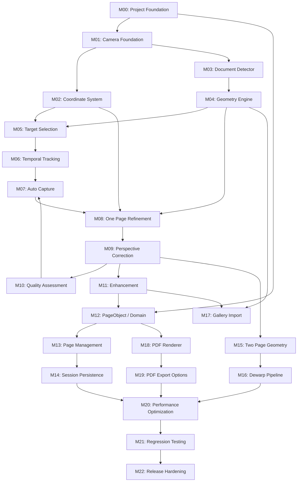

# LocalScan — Master Implementation Plan

> **For agentic workers:** Each milestone has a dedicated plan file in this directory. Execute milestones sequentially unless the dependency graph allows parallel work. Always verify the previous milestone's acceptance criteria before starting the next.

**Goal:** Transform the LocalScan project contract (PRD.md, BRIEF.md, ARCHITECTURE.md, AGENTS.md) into a fully implemented Android document scanner application.

**Architecture:** Multi-module Android project with clean separation: camera acquisition → ML detection → geometry engine → image processing → domain model → persistence → PDF export. All processing on-device, no cloud dependency.

**Tech Stack:** Kotlin, Jetpack Compose, CameraX, OpenCV Android SDK, LiteRT/TFLite, Coroutines, Gradle KTS

---

## 1. Project Objective

Build LocalScan: a native Android document scanner that:

1. Detects documents in real-time using on-device AI segmentation
2. Tracks and stabilizes detected documents temporally
3. Captures high-quality images with automatic or manual trigger
4. Corrects perspective using full-resolution geometry refinement
5. Supports One Page (flat document) and Two Page (book spread with dewarping) modes
6. Enhances scans non-destructively (Natural / Clean / Original)
7. Manages multi-page scan sessions with undo/redo
8. Exports to PDF with multiple page size and quality options
9. Works entirely offline with no cloud dependency
10. Targets mid-range Android devices (8 GB RAM)

## 2. Current Repository State

**Status:** Greenfield — no implementation exists.

| Item | State |
|------|-------|
| Git repository | **Not initialized** — no `.git` directory |
| Android project | **Does not exist** — no `build.gradle.kts`, no `settings.gradle.kts`, no `gradlew` |
| Source modules | **None** — no `:app`, `:camera`, `:detection`, `:geometry`, etc. |
| Kotlin source files | **None** |
| Test files | **None** |
| ML models | **None** |
| OpenCV integration | **None** |
| Native/JNI code | **None** |
| Resources/Assets | **None** |
| CI configuration | **None** |
| Contract documents | **Present and complete** — PRD.md, BRIEF.md, ARCHITECTURE.md, AGENTS.md |
| WORKLOG.md | **Present but empty** (0 bytes) |

**Conclusion:** Everything must be built from scratch. The only existing artifacts are the project specification documents.

## 3. Existing Implementation Summary

No implementation exists. The repository contains only:

- `PRD.md` (40,848 bytes) — Full product requirements, 35 sections
- `BRIEF.md` (21,035 bytes) — Project brief with development priorities
- `ARCHITECTURE.md` (46,122 bytes) — Technical architecture, 85 sections with interface contracts
- `AGENTS.md` (33,746 bytes) — Agent operating rules, 54 sections
- `WORKLOG.md` (0 bytes) — Empty work log

## 4. Architecture Summary

### Module Structure (from ARCHITECTURE.md)

```
:app           — Application entry, DI, navigation, UI shell
:core          — common, image, math, logging, concurrency utilities
:camera        — CameraX lifecycle, Preview, ImageAnalysis, ImageCapture, coordinate transforms
:detection     — ML model loading, inference adapter, segmentation mask, candidate extraction, tracking
:geometry      — Outer envelope, quad fitting, corner refinement, homography, perspective correction
:processing    — Enhancement pipeline (Original/Natural/Clean), quality assessment
:domain        — PageObject, Document, ScanSession, geometry types, domain interfaces
:data          — Persistence, session management, source asset lifecycle, file management
:pdf           — PDF layout, rendering, compression, page-size options, size estimation
:import        — Gallery import, image loading, orientation handling
:benchmark     — Performance measurement utilities
:testdata      — Shared test images, expected outputs, test utilities
```

### Dependency Graph

```
:app → all modules (orchestration layer)
:camera → :core
:detection → :core
:geometry → :core
:processing → :core
:domain → :core (pure domain, no Android framework deps)
:data → :domain, :core
:pdf → :domain, :processing, :core
:import → :domain, :detection, :geometry, :processing, :core
:benchmark → :core
:testdata → :core
```

### Key Architectural Contracts

1. **Dependencies point inward:** UI → Application → Domain → Infrastructure
2. **Source of truth:** PageObject (not rendered bitmap)
3. **AI is replaceable:** SegmentationModel behind interface
4. **Real-time ≠ offline processing:** different pipelines, different budgets
5. **User control:** Quality assessment never blocks capture

### Processing Pipeline

```
Camera (CameraX)
  ├── Preview → live viewfinder
  ├── ImageAnalysis → real-time detection
  │   └── SegmentationModel → mask → boundary → envelope → quad → tracking → overlay
  └── ImageCapture → high-res still
        └── coordinate mapping → geometry refinement → perspective correction
            → quality assessment → enhancement → PageObject
                → Page Manager → PDF export
```

## 5. Milestone Sequence

```
M00 — Project Foundation
 │
M01 — Camera Foundation
 │
M02 — Coordinate System
 │
M03 — Document Detector (ML integration)
 │
M04 — Geometry Engine (boundary → quad fitting)
 │
M05 — Target Selection & Tap-to-Guide
 │
M06 — Temporal Tracking & Stable Overlay
 │
M07 — Auto Capture
 │
M08 — One Page Full-Resolution Refinement
 │
M09 — Perspective Correction
 │
M10 — Quality Assessment
 │
M11 — Enhancement (Natural / Clean)
 │
M12 — PageObject & Document Domain Model
 │
M13 — Page Management & Multi-Page Workflow
 │
M14 — Session Persistence & Recovery
 │
M15 — Two Page Book-Spread Geometry
 │
M16 — Gutter / Curvature / Dewarp Pipeline
 │
M17 — Gallery Import
 │
M18 — PDF Renderer
 │
M19 — PDF Export Options & Size Estimation
 │
M20 — Performance & Memory Optimization
 │
M21 — Golden-Image & Regression Testing
 │
M22 — Device Compatibility & Release Hardening
```

## 6. Dependencies Between Milestones



### Critical Hard Dependencies

| Milestone | Hard Prerequisites |
|-----------|-------------------|
| M01 Camera | M00 Project Foundation |
| M02 Coordinates | M01 Camera |
| M03 Detector | M00 (for module structure), M01 (for ImageAnalysis frames) |
| M04 Geometry | M03 Detector (needs segmentation output) |
| M05 Target Selection | M02, M04 |
| M06 Tracking | M05 |
| M07 Auto Capture | M06, M10 (readiness check) |
| M08 One Page Refinement | M02, M04, M07 |
| M09 Perspective Correction | M08 |
| M10 Quality Assessment | M09 |
| M11 Enhancement | M09 |
| M12 PageObject | M00 (:domain module), M11 (processing output) |
| M13 Page Manager | M12 |
| M14 Persistence | M13 |
| M15 Two Page | M09, M04 |
| M16 Dewarp | M15 |
| M17 Gallery Import | M04, M11 |
| M18 PDF Renderer | M12 |
| M19 PDF Options | M18 |
| M20 Performance | M14, M16, M19 |
| M21 Regression | M20 |
| M22 Release | M21 |

### Soft Dependencies and Parallelization Opportunities

- M12 (PageObject domain model) can start alongside M01 since it's pure domain code
- M03 (Detector) can develop in parallel with M02 (Coordinates) — they both depend on M01 but not each other
- M10 (Quality) and M11 (Enhancement) can develop in parallel after M09
- M15/M16 (Two Page) can be developed independently once M09 is done
- M17 (Gallery Import) can begin once M04 and M11 are ready

## 7. Critical Path

The critical path determines the minimum time to reach a functional end-to-end scanner:

```
M00 → M01 → M02 → M03* → M04 → M05 → M06 → M07 → M08 → M09 → M11 → M12 → M13 → M14 → M18 → M19 → M20 → M21 → M22
```

*M03 includes an experimental spike (S01: Model Selection) that gates the entire detection pipeline.

**End-to-end vertical slice** (minimum for a working One Page scan → PDF):

```
M00 → M01 → M02 → M03 → M04 → M05 → M06 → M08 → M09 → M11 → M12 → M13 → M18
```

## 8. Technical Risks

### 8.1 Camera / Coordinate Risk — HIGH

**Risk:** Incorrect coordinate transformation between analysis frames, sensor, preview, and capture image spaces causes geometry to be offset, scaled incorrectly, or rotated wrong.

**Factors:**
- CameraX has 7 different coordinate spaces (Sensor, ImageAnalysis, Preview/View, Normalized, ImageCapture, Processed, PDF)
- Device rotation, crop rectangles, viewport transforms add complexity
- Portrait/landscape, different aspect ratios (4:3, 16:9) between analysis and capture
- No simple width/height scaling — CameraX transformation matrices required

**Mitigation:**
- M02 is a dedicated milestone for coordinate system correctness
- Unit tests for all coordinate transforms across rotation/aspect ratio combinations
- Integration tests with known reference images at known coordinates

### 8.2 ML Model Risk — HIGH

**Risk:** No ML model exists yet. Model selection, training, quantization, and runtime integration are all unknown.

**Factors:**
- Model must run at ≥15 FPS on mid-range devices
- Model memory must fit within the 600-700 MB normal budget
- Quantization may affect accuracy
- Hardware acceleration (GPU/NPU delegate) stability varies across devices
- No training dataset exists yet

**Mitigation:**
- Spike S01 (Model Selection) before M03 implementation
- Start with a proven open-source architecture (U-Net variant, DeepLabV3, etc.)
- CPU-first with optional acceleration
- Benchmark inference latency before committing to a model

### 8.3 Detection / Geometry Risk — MEDIUM-HIGH

**Risk:** Converting segmentation masks to reliable quadrilaterals is non-trivial. Multiple candidates, concave shapes, partial occlusion, and complex backgrounds create edge cases.

**Factors:**
- Boundary extraction from noisy masks
- Outer envelope (convex hull) must handle non-convex documents
- Quadrilateral fitting must find the best 4-sided enclosure
- Corner refinement depends on local edge structure quality
- Multiple candidates require robust identity tracking

**Mitigation:**
- M04 builds geometry engine with comprehensive test corpus
- Spike S02 (Quadrilateral Fitting) compares algorithms
- Golden-image test suite with representative edge cases

### 8.4 Temporal Tracking Risk — MEDIUM

**Risk:** Jitter, target switching, and tracker latency degrade user experience.

**Factors:**
- Smoothing must reduce jitter without adding perceptible lag
- Target identity must persist through brief detector dropouts
- Multiple overlapping documents create ambiguous targets

**Mitigation:**
- Spike S03 (Temporal Filter Comparison)
- Quantitative jitter measurement benchmark
- State machine with defined transitions and timeouts

### 8.5 Book Scanning Risk — HIGH

**Risk:** Two Page mode requires gutter detection, curvature estimation, and dewarping — complex computer vision that may not generalize well.

**Factors:**
- Books don't always open flat — varying curvature
- Gutter may be dark or partially occluded
- Left/right pages may have different curvature
- Dewarp mesh must be geometrically correct to avoid text distortion
- No existing implementation or training data

**Mitigation:**
- Spikes S04 (Dewarp Strategy) and S05 (Gutter Detection)
- Dedicated test corpus of book spread images
- Start with geometric model-based dewarping before ML-based
- Accept imperfect results initially; iterate based on measurements

### 8.6 Enhancement Risk — MEDIUM

**Risk:** Enhancement may destroy document content (handwriting, pencil, faint text) or produce unnatural results.

**Factors:**
- Shadow removal can eliminate faint marks
- Sharpening can introduce artifacts
- Clean mode must avoid aggressive binarization
- Color preservation across different document types
- Handwriting/pencil/colored ink preservation is critical

**Mitigation:**
- Spike S06 (Enhancement Pipeline Comparison)
- Non-destructive architecture (always re-renderable from source)
- Test corpus with handwriting, pencil, colored documents
- Conservative default parameters

### 8.7 Memory Risk — HIGH

**Risk:** Full-resolution images (4032×3024 = ~48 MB uncompressed ARGB), OpenCV Mat objects, ML tensors, and multi-page sessions can exceed 800 MB peak budget.

**Factors:**
- Full-res ARGB bitmap: ~48 MB per image
- OpenCV Mat: equally large native allocations
- ML model: 10-50+ MB depending on architecture
- Multiple pages in a session: unbounded without management
- PDF export decodes and processes each page
- Native memory not tracked by Java GC

**Mitigation:**
- ImageSource abstraction (ROI decoding, not full bitmap)
- File-backed source assets
- Page-by-page PDF rendering
- Explicit OpenCV Mat release in try/finally
- Memory profiling at each milestone
- 20-page stress test

### 8.8 Persistence Risk — MEDIUM

**Risk:** Session data loss on process death, configuration change, or unexpected interruption.

**Factors:**
- Source assets must survive process death
- Session metadata must be incrementally saved
- Interrupted processing should be recoverable
- Cache invalidation for derived images

**Mitigation:**
- M14 implements incremental persistence
- File-backed source assets (survive process death by default)
- Room or equivalent for session metadata
- Integration tests for recovery scenarios

### 8.9 PDF Risk — MEDIUM

**Risk:** Layout issues with different page sizes, aspect ratio preservation, compression quality, and file size estimation accuracy.

**Factors:**
- Aspect ratio preservation with fixed page sizes (A4, Letter) requires layout logic
- Quality profiles affect JPEG compression and output resolution
- File size estimation must be reasonably accurate before generation
- Page-by-page streaming must keep memory constant

**Mitigation:**
- M18/M19 with detailed test cases per page size
- Benchmark compression ratios for estimation model
- Validate with PDF viewers and PDF/A standards

## 9. Experimental Spikes

### S01: Segmentation Model Selection
- **Plan file:** `plans/spikes/S01-model-selection.md`
- **Gate:** Must complete before M03

### S02: Quadrilateral Fitting Algorithm
- **Plan file:** `plans/spikes/S02-quad-fitting.md`
- **Gate:** Must complete before M04

### S03: Temporal Filter Comparison
- **Plan file:** `plans/spikes/S03-temporal-filter.md`
- **Gate:** Must complete before M06

### S04: Dewarp Strategy
- **Plan file:** `plans/spikes/S04-dewarp-strategy.md`
- **Gate:** Must complete before M16

### S05: Enhancement Pipeline
- **Plan file:** `plans/spikes/S05-enhancement-pipeline.md`
- **Gate:** Must complete before M11

### S06: Full-Resolution ROI Decoding
- **Plan file:** `plans/spikes/S06-roi-decoding.md`
- **Gate:** Must complete before M08

## 10. Validation Strategy

Every milestone has specific validation criteria. The overall strategy:

| Stage | Validation Method |
|-------|------------------|
| Camera | Lifecycle tests, orientation tests, resolution verification |
| Coordinates | Unit tests across all rotation/aspect ratio combinations |
| Detection | Segmentation quality (IoU), corner localization error (px), FPS measurement |
| Geometry | Quadrilateral IoU vs ground truth, corner error, edge error |
| Tracking | Jitter measurement (px/frame), target switch rate, dropout tolerance |
| Auto Capture | Countdown accuracy, false trigger rate, manual override |
| Refinement | Corner error improvement (analysis→refined), ROI memory savings |
| Perspective | Visual correctness, aspect ratio preservation, content integrity |
| Quality | Metric correlation with human assessment, no false rejections |
| Enhancement | Readability, color preservation, handwriting/pencil safety |
| PageObject | Serialization roundtrip, non-destructive re-rendering |
| Page Manager | Operation correctness, undo/redo integrity |
| Persistence | Recovery after process death, incremental save verification |
| Two Page | Page split accuracy, gutter detection, dewarp quality |
| PDF | Valid PDF output, correct dimensions, aspect ratio, size estimation accuracy |
| Performance | Memory profiling, latency benchmarks, thermal measurement |

## 11. Testing Strategy

### Test Categories

1. **Unit Tests** — Pure logic, no Android framework
   - Geometry math (quadrilateral, homography, envelope, fitting)
   - Coordinate transformations
   - Target selection logic
   - Temporal tracking / smoothing algorithms
   - PageObject operations
   - PDF layout calculations
   - Size estimation

2. **Integration Tests** — Cross-module pipelines
   - Detection → Geometry pipeline
   - Geometry → Processing pipeline
   - Processing → PageObject pipeline
   - PageObject → PDF pipeline
   - Session persistence → recovery

3. **Instrumentation Tests** — On-device with Android framework
   - CameraX lifecycle (open, preview, capture, release)
   - Permission handling
   - Device rotation
   - Flash/torch modes
   - Tap-to-guide
   - Session recovery after process death
   - Gallery import

4. **Golden-Image Tests** — Deterministic regression
   - Fixed test corpus → known expected geometry
   - Perspective correction output comparison
   - Enhancement output comparison
   - Two Page split comparison

5. **Stress Tests** — Robustness and memory
   - 20+ page scan session
   - Repeated capture/process cycles
   - Enhancement mode switching
   - PDF export at all quality levels
   - Large source images (12 MP+)

### Test Corpus Requirements

The test corpus must contain representative samples for:

| Category | Examples |
|----------|----------|
| Standard documents | A4, Letter, A5 |
| Small documents | Business cards, credit cards, receipts |
| Handwritten | Notes, forms with pen/pencil |
| Perspective | Moderate angle, extreme angle |
| Rotation | 0°, 90°, 180°, 270°, arbitrary |
| Lighting | Normal, shadow, glare, poor lighting |
| Background | Clean desk, cluttered, textured |
| Multiple documents | 2-3 documents visible |
| Complex/concave | Irregular shapes |
| Occlusion | Fingers, hands, partial |
| Books | Open spread, curved pages |
| Color | Colored paper, colored ink |

## 12. Performance Strategy

### Budgets (from PRD.md §22 and ARCHITECTURE.md §17)

| Metric | Target |
|--------|--------|
| Normal working memory | ≤ 600-700 MB |
| Peak memory | ≤ 800 MB |
| ML inference latency | ≤ 50 ms on mid-range |
| Analysis FPS | ≥ 15 FPS |
| Overlay latency | ≤ 2 frames |
| Full-res geometry | ≤ 500 ms |
| Enhancement | ≤ 1 second |
| Capture-to-preview | ≤ 3 seconds |
| PDF per-page render | ≤ 2 seconds |
| PDF export (10 pages) | ≤ 25 seconds |

### Measurement Points

Performance is measured, not guessed. Each milestone must establish baselines for its domain:

- **M01:** Camera startup time, preview FPS, capture latency
- **M03:** Inference latency, model memory, effective analysis FPS
- **M06:** Overlay update latency, jitter metrics
- **M08:** ROI decode time, refinement time, peak memory
- **M09:** Perspective correction time, bitmap memory
- **M11:** Enhancement processing time
- **M18:** PDF render time per page, peak memory during export
- **M20:** Comprehensive profiling across all subsystems

## 13. Memory Strategy

### Core Principles

1. **File-backed sources:** Captured images stored as files, not held as Bitmaps
2. **ROI decoding:** Use `BitmapRegionDecoder` for corner refinement, not full-image decode
3. **ImageSource abstraction:** Controls access to image data with lifecycle management
4. **Page-by-page processing:** Never hold all rendered pages in memory
5. **Explicit native release:** OpenCV Mat objects released in try/finally blocks
6. **ML model lifecycle:** Model loaded once per camera session, released on exit

### Prohibited Patterns

```kotlin
// NEVER: Hold all pages as bitmaps
val allPages = pages.map { renderPage(it) }

// NEVER: Decode full image when only corners needed
val fullBitmap = BitmapFactory.decodeFile(path)
val corner = Bitmap.createBitmap(fullBitmap, x, y, w, h)

// NEVER: Forget to release OpenCV Mat
val mat = Imgcodecs.imread(path)
// use mat
// mat.release() missing!
```

### Required Patterns

```kotlin
// YES: Process one page at a time
for (page in document.pages) {
    val bitmap = renderPage(page)
    pdfWriter.addPage(bitmap)
    bitmap.recycle()
}

// YES: ROI decoding
val decoder = BitmapRegionDecoder.newInstance(path, false)
val corner = decoder.decodeRegion(cornerRect, options)
// process corner
corner.recycle()
decoder.recycle()

// YES: Explicit release
val mat = Mat()
try { /* use mat */ } finally { mat.release() }
```

## 14. Git Checkpoint Strategy

### Repository Initialization (M00)

```bash
git init
git add .
git commit -m "docs: establish project contract documents"
```

### Milestone Checkpoints

Each completed milestone produces a checkpoint commit:

| Milestone | Commit Message |
|-----------|---------------|
| M00 | `chore: initialize Android project with multi-module structure` |
| M01 | `feat(camera): add CameraX foundation with Preview, Analysis, Capture` |
| M02 | `feat(camera): add coordinate transformation system` |
| M03 | `feat(detection): integrate local segmentation model` |
| M04 | `feat(geometry): add boundary extraction and quadrilateral fitting` |
| M05 | `feat(detection): add target selection and tap-to-guide` |
| M06 | `feat(detection): add temporal tracking with stable overlay` |
| M07 | `feat(camera): add Auto Capture with 2-second countdown` |
| M08 | `feat(geometry): add full-resolution corner refinement` |
| M09 | `feat(geometry): add perspective correction pipeline` |
| M10 | `feat(processing): add quality assessment metrics` |
| M11 | `feat(processing): add Natural and Clean enhancement` |
| M12 | `feat(domain): add PageObject and Document model` |
| M13 | `feat(domain): add Page Manager with undo/redo` |
| M14 | `feat(data): add session persistence and recovery` |
| M15 | `feat(geometry): add Two Page book-spread detection` |
| M16 | `feat(geometry): add gutter detection and dewarping` |
| M17 | `feat(import): add gallery image import pipeline` |
| M18 | `feat(pdf): add PDF renderer with page-by-page streaming` |
| M19 | `feat(pdf): add export options and size estimation` |
| M20 | `perf: optimize memory and processing performance` |
| M21 | `test: add golden-image and regression test suite` |
| M22 | `chore: release hardening and device compatibility` |

### Within-Milestone Commits

For milestones with multiple implementation steps, use intermediate commits:

```
feat(camera): add CameraX provider initialization
feat(camera): add Preview use case
feat(camera): add ImageAnalysis with latest-frame strategy
feat(camera): add ImageCapture with file-backed output
test(camera): add CameraX lifecycle tests
```

### Rules

- `git status` before every milestone start
- No `git reset --hard` or `git clean -fd` without explicit instruction
- No commits with knowingly broken builds (use `wip:` prefix if necessary)
- No secrets or large generated artifacts in commits

## 15. Definition of Done

A milestone is **done** when:

1. ✅ All implementation steps are complete
2. ✅ Code compiles without errors
3. ✅ All new tests pass
4. ✅ All pre-existing tests still pass
5. ✅ Acceptance criteria from the milestone plan are met
6. ✅ Performance measurements are recorded (where applicable)
7. ✅ Memory usage is within budget (where applicable)
8. ✅ Failure cases degrade gracefully (not crash)
9. ✅ Code follows established architecture patterns
10. ✅ PRD invariants are preserved
11. ✅ Git checkpoint commit is created
12. ✅ WORKLOG.md is updated with milestone results

**"Compiles" is not done.** (AGENTS.md §51)

## 16. Conditions Required Before Autonomous Implementation Begins

Before the first implementation milestone (M00) can begin:

1. ✅ All contract documents reviewed and understood
2. ✅ Repository state audited
3. ✅ Master plan created with milestone sequence
4. ✅ Individual milestone plans created
5. ✅ Experimental spike plans created
6. ✅ Requirements traceability verified
7. ✅ Architectural risks identified with mitigation strategies
8. ✅ Test data strategy defined
9. ✅ Performance budgets documented
10. ✅ Git checkpoint strategy defined
11. ✅ Planning commit made

**Implementation readiness:** READY after this planning commit.

---

## Appendix A: Requirements Traceability Map

Every major PRD requirement is mapped to one or more milestones:

| Requirement | PRD Section | Milestone(s) |
|-------------|-------------|--------------|
| CameraX integration | §4, §5 | M01 |
| Preview (PreviewView) | §5.2 | M01 |
| ImageAnalysis (latest-frame) | §5.3 | M01, M03 |
| ImageCapture (quality, file-backed) | §5.4 | M01 |
| Continuous autofocus | §5.5 | M01 |
| Auto exposure / white balance | §5.5 | M01 |
| Tap-to-focus / metering | §5.6 | M05 |
| Flash modes (off/on/torch) | §5.7 | M01 |
| Document segmentation (AI) | §6.1 | M03, S01 |
| Candidate detection | §6.2, §6.3 | M04 |
| Candidate selection | §6.3 | M05 |
| Target locking | §6.4 | M05, M06 |
| Temporal tracking | §7 | M06, S03 |
| Live overlay | §8 | M06 |
| Auto Capture (2s countdown) | §9 | M07 |
| Manual shutter (always available) | §9.3 | M07 |
| Coordinate transformation | §10, §11 | M02 |
| Full-resolution refinement | §11.4 | M08, S06 |
| Outer envelope | §11.2 | M04 |
| Quadrilateral fitting | §11.1 | M04, S02 |
| Complex/concave handling | §11.3 | M04 |
| Corner refinement | §11.4 | M08 |
| Perspective correction | §11.5 | M09 |
| One Page mode | §13 | M08, M09 |
| Two Page mode | §14 | M15, M16 |
| Book spread detection | §14.1 | M15 |
| Page boundaries | §14.1 | M15 |
| Gutter detection | §14.2 | M16 |
| Curvature estimation | §14.3 | M16 |
| Dewarping (mandatory) | §14.4 | M16, S04 |
| Quality assessment | §15 | M10 |
| Natural enhancement | §16.1 | M11, S05 |
| Clean enhancement | §16.2 | M11, S05 |
| Non-destructive processing | §15, §17 | M11, M12 |
| PageObject | §16 | M12 |
| Document model | §21 | M12 |
| Page Manager | §17 | M13 |
| Manual crop (post-capture) | §17 | M13 |
| Rotate | §17 | M13 |
| Replace/retake | §17 | M13 |
| Duplicate | §17 | M13 |
| Delete | §17 | M13 |
| Undo/redo | §17 | M13 |
| Multi-page workflow | §18, §19 | M13 |
| Session persistence | §21, §24 | M14 |
| Session recovery | §24 | M14 |
| Gallery import | §19, §20 | M17 |
| Local storage / privacy | §20, §23 | M14 |
| Offline processing | §20.1 | All milestones |
| PDF rendering | §22 | M18 |
| PDF page sizes (A4, Auto, etc.) | §22.1 | M19 |
| Quality profiles (High/Balanced/Small) | §22.4 | M19 |
| File-size estimation | §22.5 | M19 |
| PDF filename editing | §22.6 | M19 |
| Memory management | §3.3, §22 | M20, all milestones |
| ML runtime | §25 | M03 |
| ML model lifecycle | §25 | M03 |
| Benchmarking | §24, §27, §29 | M20, M21 |
| Golden-image testing | §28.3 | M21 |
| Device testing | §28 | M22 |
| Performance testing | §24 | M20, M21 |
| Thermal testing | §24.4 | M22 |
| Error handling | §29 | All milestones |
| OCR future extensibility | §23, §26 | M12 (interface only) |

## Appendix B: Product Invariants Checklist

Every milestone must preserve these invariants (PRD.md §2, §32):

- [ ] 1. Physical document geometry is authoritative
- [ ] 2. PDF page size does not control document detection
- [ ] 3. Standard document output uses enclosing quadrilateral
- [ ] 4. Complex/concave documents use enclosing quadrilateral
- [ ] 5. User can always manually capture
- [ ] 6. Quality assessment never forces a retake
- [ ] 7. Tap-to-guide controls target selection (not manual crop editor)
- [ ] 8. Temporal tracking prevents arbitrary target switching
- [ ] 9. One Page and Two Page use different geometry pipelines
- [ ] 10. Two Page always performs curved-page dewarping
- [ ] 11. Enhancement is non-destructive
- [ ] 12. Source asset remains authoritative
- [ ] 13. Core processing works offline
- [ ] 14. Full-resolution page bitmaps not all retained in RAM
- [ ] 15. PDF output is streamed page-by-page
- [ ] 16. OCR is not required for the initial release
- [ ] 17. Visual design is handled separately

## Appendix C: Milestone Plan Files

| File | Milestone |
|------|-----------|
| `plans/001-project-foundation.md` | M00: Project Foundation |
| `plans/002-camera-foundation.md` | M01: Camera Foundation |
| `plans/003-coordinate-system.md` | M02: Coordinate System |
| `plans/004-document-detector.md` | M03: Document Detector |
| `plans/005-geometry-engine.md` | M04: Geometry Engine |
| `plans/006-target-selection.md` | M05: Target Selection |
| `plans/007-temporal-tracking.md` | M06: Temporal Tracking |
| `plans/008-auto-capture.md` | M07: Auto Capture |
| `plans/009-one-page-refinement.md` | M08: One Page Refinement |
| `plans/010-perspective-correction.md` | M09: Perspective Correction |
| `plans/011-quality-assessment.md` | M10: Quality Assessment |
| `plans/012-enhancement.md` | M11: Enhancement |
| `plans/013-page-object.md` | M12: PageObject & Domain |
| `plans/014-page-management.md` | M13: Page Management |
| `plans/015-session-persistence.md` | M14: Session Persistence |
| `plans/016-two-page-book.md` | M15: Two Page Geometry |
| `plans/017-dewarp.md` | M16: Dewarp Pipeline |
| `plans/018-gallery-import.md` | M17: Gallery Import |
| `plans/019-pdf-renderer.md` | M18: PDF Renderer |
| `plans/020-pdf-export.md` | M19: PDF Export Options |
| `plans/021-performance.md` | M20: Performance Optimization |
| `plans/022-regression-testing.md` | M21: Regression Testing |
| `plans/023-release-hardening.md` | M22: Release Hardening |

### Spike Plan Files

| File | Spike |
|------|-------|
| `plans/spikes/S01-model-selection.md` | S01: Segmentation Model Selection |
| `plans/spikes/S02-quad-fitting.md` | S02: Quadrilateral Fitting Algorithm |
| `plans/spikes/S03-temporal-filter.md` | S03: Temporal Filter Comparison |
| `plans/spikes/S04-dewarp-strategy.md` | S04: Dewarp Strategy |
| `plans/spikes/S05-enhancement-pipeline.md` | S05: Enhancement Pipeline |
| `plans/spikes/S06-roi-decoding.md` | S06: Full-Resolution ROI Decoding |
